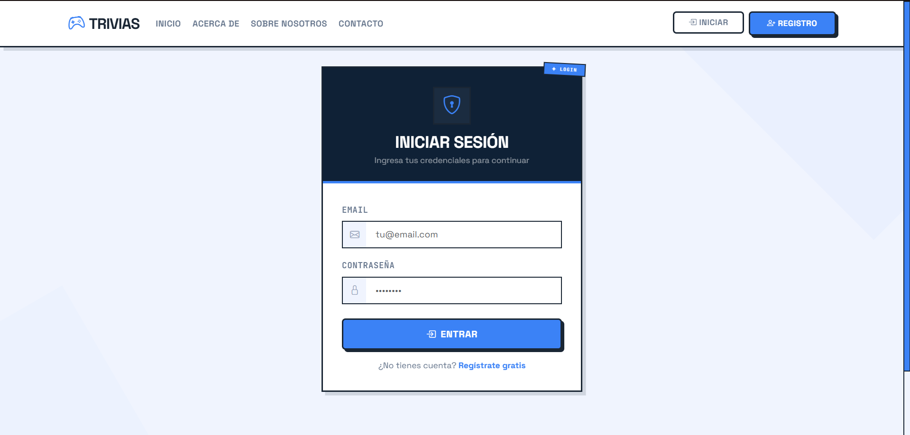
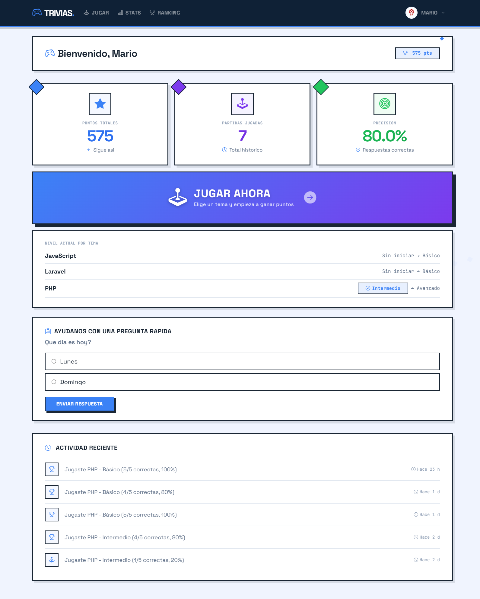
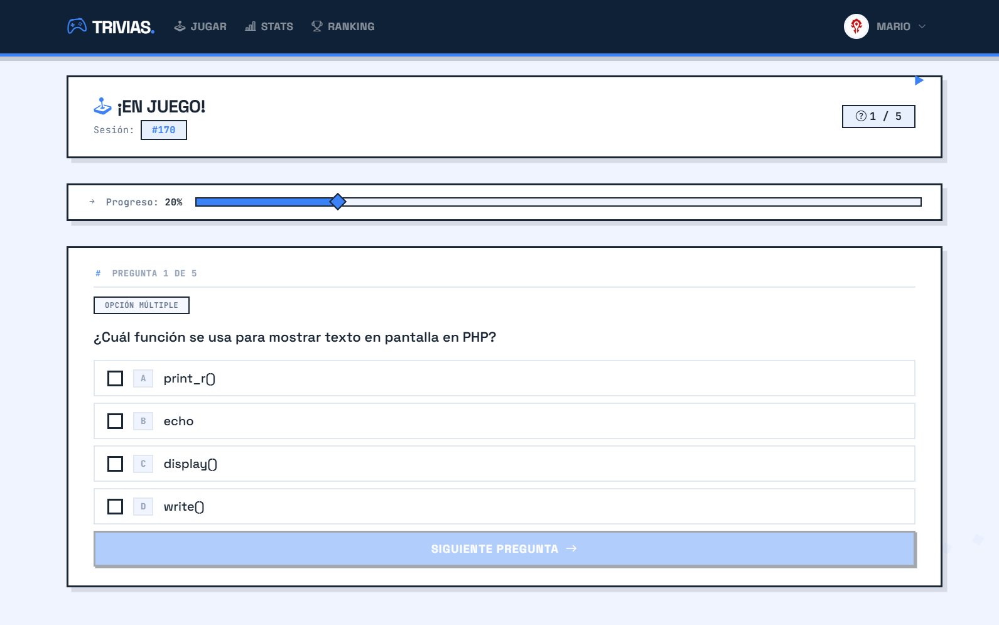
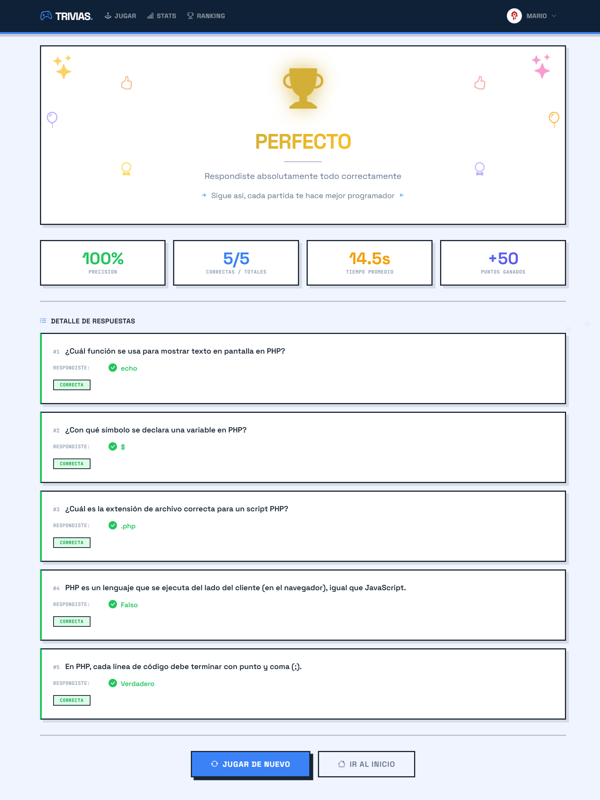
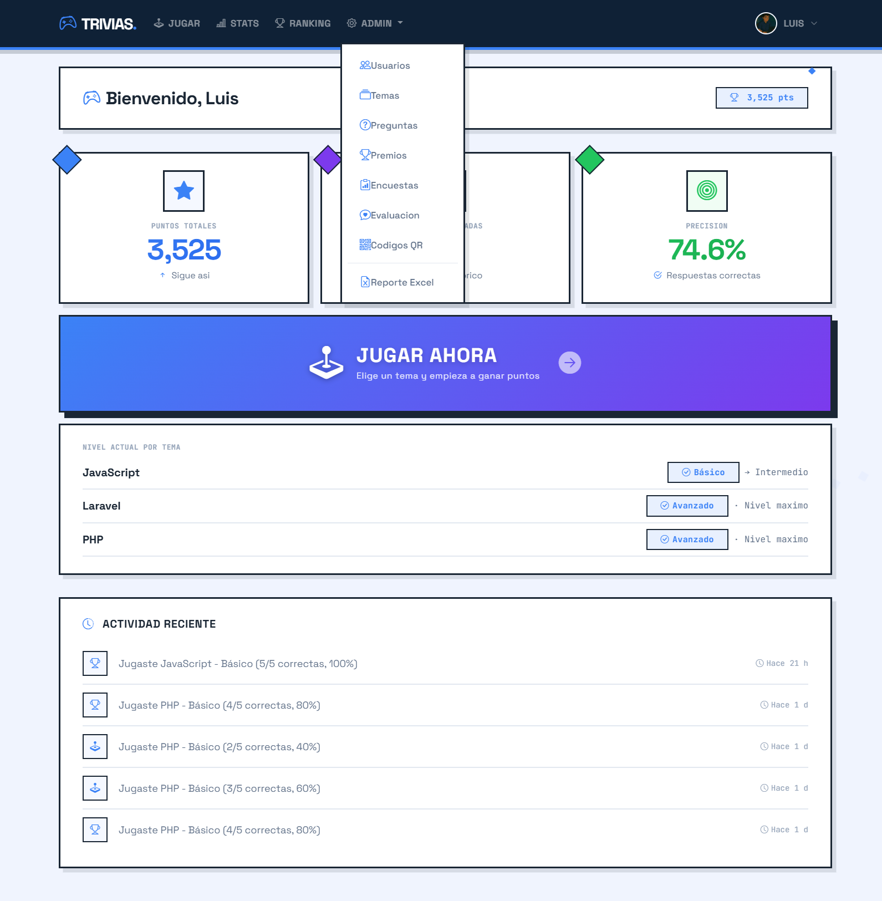
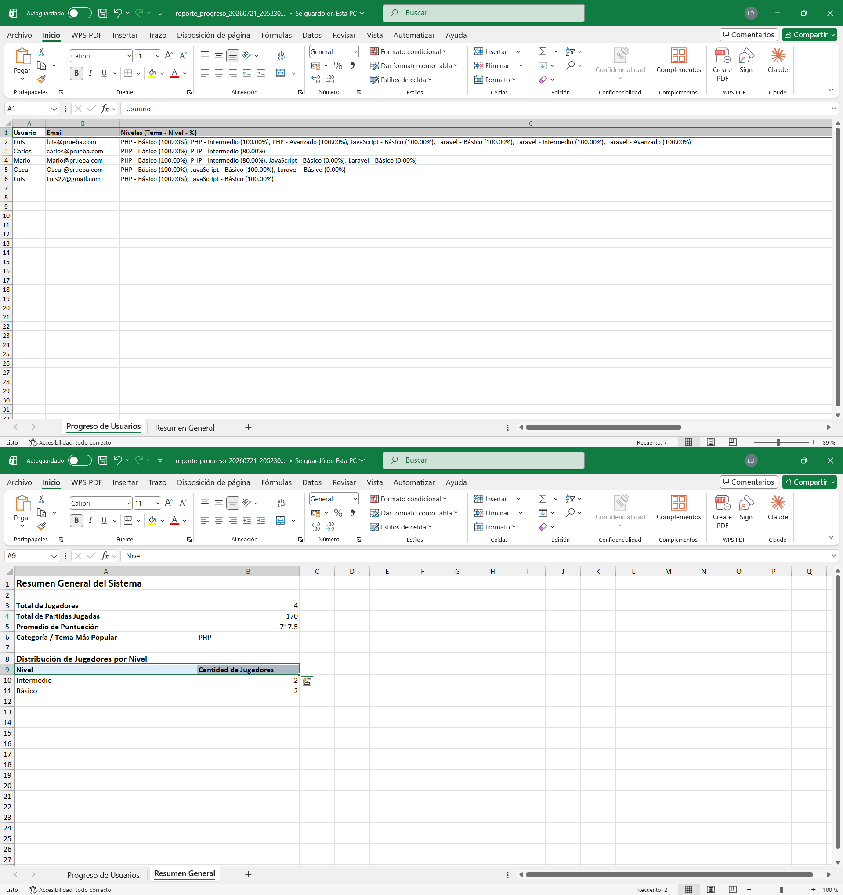

# Sistema de Trivias

Proyecto semestral final - Desarrollo de Software VII


Plataforma de trivias gamificada desarrollada en PHP nativo (POO, MVC, PDO).

## Descripcion

El sistema permite a los usuarios jugar trivias por temas y niveles de dificultad (Basico, Intermedio, Avanzado), ganando puntos y premios segun su desempeno. Incluye roles diferenciados para jugadores, armadores de contenido y administradores.

## Funcionalidades principales

- Login con control de intentos fallidos (bloqueo temporal por IP)
- Registro publico de jugadores
- Roles: jugador, armador, administrador
- Temas y niveles con progresion obligatoria (80% de aciertos para avanzar)
- Preguntas de opcion multiple y verdadero/falso
- Sistema de premios asociados a niveles
- Avatar de perfil y visualizacion de puntos acumulados
- Estadisticas y calificacion de temas ("Me gusta")
- Ranking, encuestas y feedback de la aplicacion
- Reporte de progreso exportable a Excel

## Arquitectura

PHP nativo bajo patron MVC (sin frameworks), con MySQL/PDO. Seguridad implementada con tokens CSRF en cada formulario, consultas preparadas, sanitizacion y validacion centralizada, y firma digital (HMAC) sobre datos sensibles.

```
public/index.php  ->  clases/Router.php  ->  app/controllers/*  ->  app/models/*  ->  views/*
```

## Capturas de ejecucion

*(coloca los archivos en `docs/screenshots/` con estos nombres)*

**Inicio de sesion**


**Panel principal del jugador**


**Partida de trivia en curso**


**Resultados y puntos obtenidos**


**Panel de administracion**


**Reporte generado en Excel**


## Roles de usuario

| Rol | Permisos |
|---|---|
| Jugador | Jugar trivias, ver su perfil, puntos y ranking |
| Armador | Crear y administrar temas, preguntas y premios |
| Administrador | Gestion completa de usuarios, contenido y reportes |

## Instalacion (WampServer)

1. Copiar el proyecto a `C:\wamp64\www\trivias\`
2. Ejecutar `composer install`
3. Crear la base de datos `trivias_db` (charset `utf8mb4`) e importar el script SQL con los seeders
4. Configurar `config/database.php` con las credenciales locales
5. Activar `mod_rewrite` en Apache
6. Abrir `http://localhost/trivias/public/`

## Equipo

- Jeremy Rodriguez (8-992-2180)
- Daniel Comrie (8-984-1565)
- Luis De Leon (3-750-2425)

## Curso

Desarrollo de Software VII - Profesora Irina Fong
